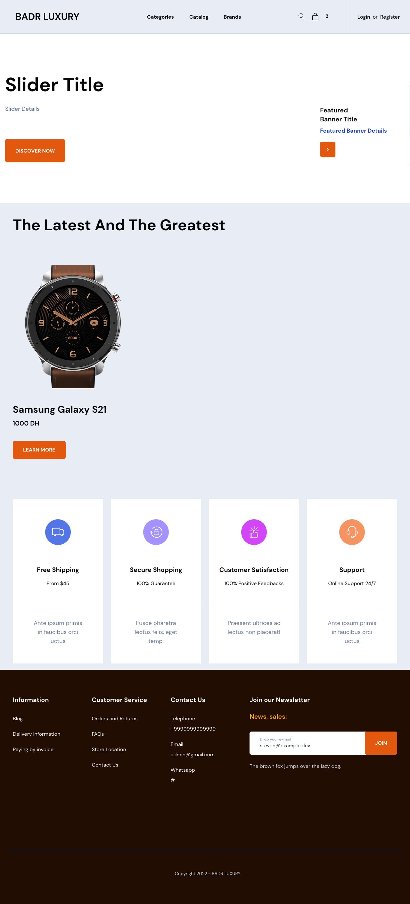
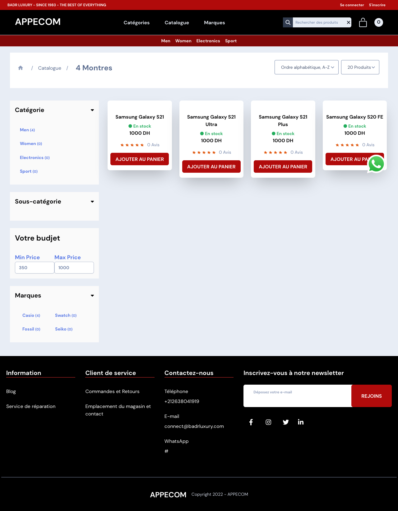
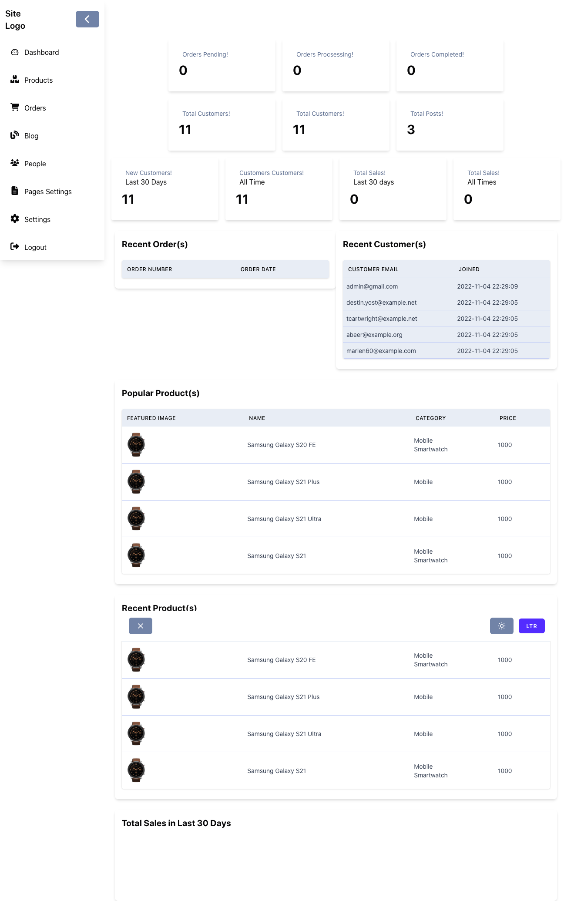
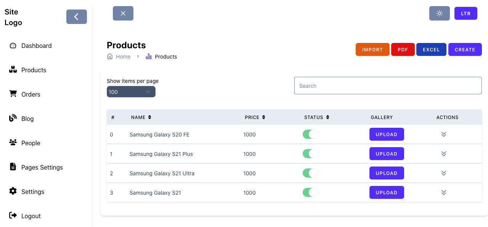
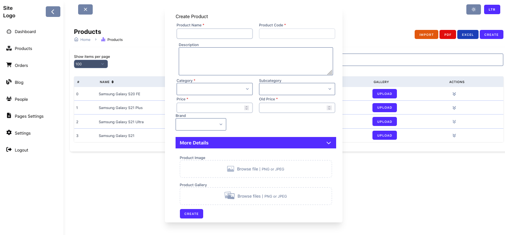

# Laravel Ecommerce - 

Laravel Ecommerce shopping cart project! This project is a full-featured online store platform, built using the Laravel & Tall stack. You can easily set up and manage your own online store, with a complete with for managing orders, products, and website informations. Some of the key features of our shopping cart include:

- A clean and intuitive user interface for browsing and purchasing products
- A powerful and flexible backend for managing orders, products, and customers
    
## Roadmap

- [x] Dashboard
- [x] Products
- [x] Categories
- [x] SubCategorires
- [x] Brands
- [x] Shipping
- [x] Settings
- [ ] Pages 

## Requirements

-   PHP >= 8.0 (or higher)
-   Composer
-   Node.js
-   NPM
-   MySQL

## Installation

1.  Clone the repository
2.  Run `composer install`
3.  Run `npm install`
4.  Run `npm run dev`
5.  Create a database and update the `.env` file
6.  Run `php artisan migrate --seed`
7.  Run `php artisan serve`
8.  Login with the following credentials
    -   Email: `admin@ggmail.com`
    -   Password: `password`
9.  Enjoy!

## Screenshots

- Home

- Catalog

- Dashboard

- DashboardProducts

- ProductCreate

## Contact

-   [Twitter](https://twitter.com/zakarialabib)
-   [LinkedIn](https://www.linkedin.com/in/zakaria-labib/)
-   [GitHub](https://www.github.com/zakarialabib/)
