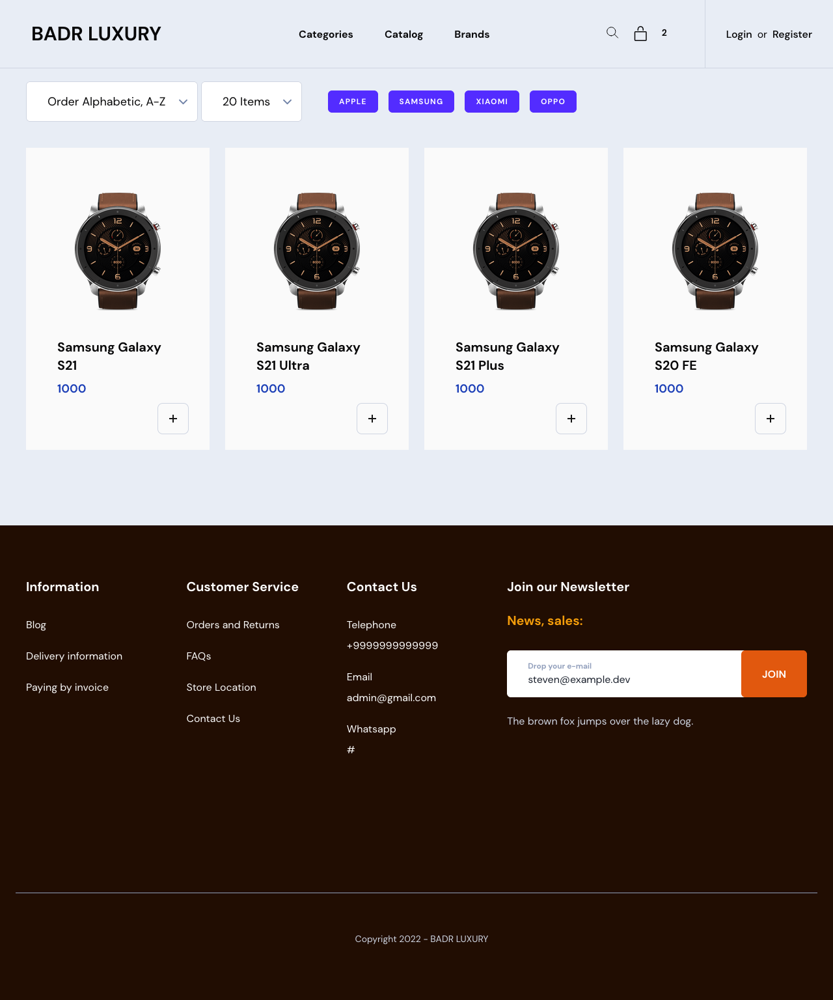
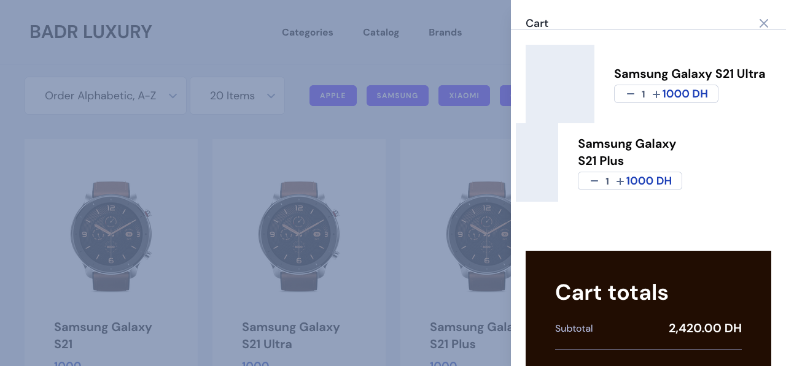

# appEcom

This is a powerful e-commerce application, with a lot of features, and it's still under development.

## Roadmap

- [x] Dashboard
- [x] Products
- [x] Categorires
- [x] Brands
- [x] Pages 

## Requirements

-   PHP >= 8.0 (or higher)
-   Composer
-   Node.js
-   NPM
-   MySQL

## Installation

1.  Clone the repository
2.  Run `composer install`
3.  Run `npm install`
4.  Run `npm run dev`
5.  Create a database and update the `.env` file
6.  Run `php artisan migrate --seed`
7.  Run `php artisan serve`
8.  Login with the following credentials
    -   Email: `admin@ggmail.com`
    -   Password: `password`
9.  Enjoy!

## Screenshots

- Home

- BrandPage

- CartSideBar

- Dashboard

- DashboardProducts

- ProductCreate

## Contact

-   [Twitter](https://twitter.com/zakarialabib)
-   [LinkedIn](https://www.linkedin.com/in/zakaria-labib/)
-   [GitHub](https://www.github.com/zakarialabib/)
